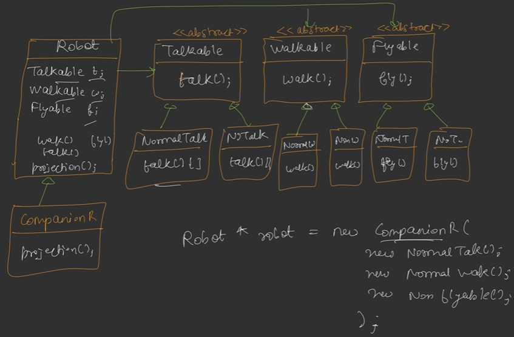

# Design Patterns

## Strategy Design Pattern:

Defines a family of algorithms, puts them into separate classes which can be dynamically swapped at runtime. For example, in the example below, we created interfaces for all types of robots and defined overridden methods in the classes implementing them. Then at runtime, according to requirements, directly the required method is called through polymorphism.



## Factory Design Pattern:

It encapsulates object instantiation logic inside a dedicated class. Here, we do not need to instantiate a object using the new keyword, instead we just pass the parameters to the factory which then returns the correct object type.


### Factory method:

Here, the factory is also abstract, there may be different types of factories that create different objects. It allows multiple factory subclasses that can instantiate objects.


### Abstract factory method:

It allows for creation of multiple products through a factory and its subclasses. 

## Singleton Design Pattern:

A singleton class is the one that can be instantiated only once. Even if we try to create multiple objects for it, they will all point to and return the first one itself.

Now, one thing to note while creating a singleton is to make it thread-safe. Because if multiple threads are executing the application, all those will create their own objects. For this purpose, one simple way could be to use locking(double locking) and checking whether the object has been created before or not, the locking will only be done if object is not created already, second check will be done  (checking if object is created or not - same as before) and then creating object. Otherwise, just return that object.

Another way to avoid all this is to use eager initialization which involves creating the object before the main class is run. But the main disadvantage here is that in real life if that object is not used, it will lead to a huge waste of resources.

Following is a simple implementation without thread safety:

```java
class Singleton{
    private static Singleton instance = null;
    private Singleton(){
        System.out.println("Singleton constructor called");
    }
    public static Singleton getInstance(){
        if(instance==null)
            instance = new Singleton();
        return instance;
    }
}

public class SingletonExample{
    public static void main(String[] args){
        Singleton s1 = Singleton.getInstance();
        Singleton s2 = Singleton.getInstance();
        System.out.println(s1==s2);
    }
}
```

Below example shows the same thing with locking and thread safety:

```java
import java.util.concurrent.locks.Lock;
import java.util.concurrent.locks.ReentrantLock;
class Singleton{
    //Using volatile keyword as without it, JVM allows reordering across different threads 
    private static volatile Singleton instance = null;
    private static Lock mutex = new ReentrantLock();
    private Singleton(){
        System.out.println("Singleton constructor called");
    }
    public static Singleton getInstance(){
        if(instance==null) {
            mutex.lock();
            try {
                if(instance==null)
                    instance = new Singleton();
            }
            finally{
                mutex.unlock();
            }
        }
        return instance;
    }
}

public class SingletonExample{
    public static void main(String[] args){
        Singleton s1 = Singleton.getInstance();
        Singleton s2 = Singleton.getInstance();
        System.out.println(s1==s2);
    }
}
```

## Observer Design Pattern:

It involves an observable object and an observer(another object). The observer should read any state changes of the observable(if any). Formally, this design pattern defines a one to many relationship between objects so that one object changes state, all of its dependents are notified and updated automatically. For this purpose, there are many methods such as:

1. Polling - Gather data periodically. It sends requests to the observable and observable responds with the appropriate response. But this is write intensive and very time consuming.
2. Pushing - Whenever there is a state change, the observable pushes the change(or sends) to all the observers. The observable needs to have information about the observers.


## Decorator Design Pattern:

Traditional inheritance may lead to class explosion - where each new change requires more classes to be created. There may be times where we need to combine two or more classes, so creating classes for all combinations will lead to a huge number of classes.

Decorator pattern wraps another object as decorator over the base object and can enhance the output of the base object dynamically. Multiple decorators can be stacked up which access the base object by inheritance but modify output using composition. This all can be done at runtime.


In this example, we can see that we are creating an object at runtime and can pass all required parameters during runtime(whatever combination we need). The decorator calls those classes along with the base character function.

## Command Design Pattern:

The **Command Design Pattern** is **a behavioral software design pattern that encapsulates a request as a standalone object, containing all the information needed to perform an action**. This  completely decouples the object that triggers the operation (the sender/invoker) from the object that actually knows how to execute it (the receiver).

## Adapter Design Pattern:

It is a design pattern which allows objects with different interfaces to work together. It acts as a bridge between two difference incompatible interfaces and helps them to work together. 

