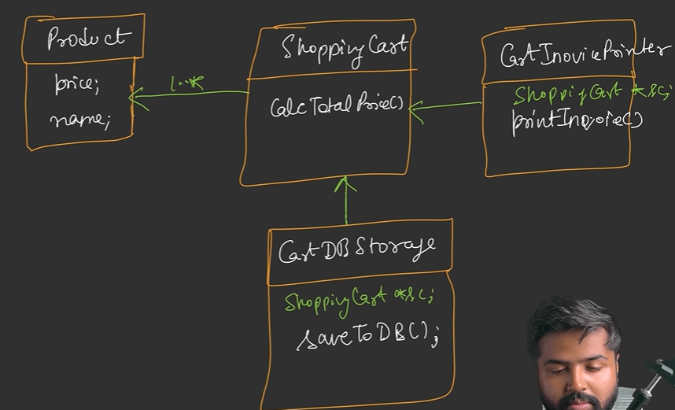

# SOLID Principles

### S: Single Responsibility Principle:

A class should only have one responsibility. There should only be one reason for a class to change. In other words, all the methods defined in a class should together handle one responsibility only. If not, create different classes for it. 

Advantages:

1. Loosely coupled architecture.
2. Modification needed only in one class if there is change in one logic.
3. Easier to maintain and provides high readibility.

### O: Open Close Principle:

A class should be open for extension(adding new features) but close for modification(not changing existing code). 

One way to do so is to make a class abstract (concrete - which defines all methods/method signature) and then implement new classes for each method. For example, create an interface in spring which defines all methods and then create a class for each of the methods. Also, polymorphism and inheritance can be used to override methods which perform similar functionality by inheriting the main/parent method from the abstract class.

### L: Liskov Substitution Principle:

It states that the objects of a superclass must be replaceable with objects of a subclass without breaking the application. In simpler words, we can pass the reference of a subclass wherever the reference of the base class is to be passed. Following is the example where it breaks:

Here, the client calls deposit and withdraw functions. According to the principle, all three types of accounts should be able to call both functions. But, in fixed deposit, we can only withdraw after a certain time interval and hence if deposit is called before that, it will throw an error. This breaks the principle as it states that all subclasses should be able to call methods of base class. One thong that can be done is to break interfaces into separate parts and then implement methods.

Guidelines:

1. In overridden methods, the return type should either be the same as parent method or a narrower one. It shouldn’t be broader than parent method return type(should be lower in hierarchy). Similar for exceptions as well.
2. Class invariant - Invariant means a rule that should always hold true for a particular class. The rule is user defined logic.

### I: Interface Segregation Principle:

It states that many client specific interfaces are better than one general interface. Clients should not implement methods that are irrelevant to them. In the below example, 2d shaped don’t need a volume function but a 3d shape does. Hence, we create two separate interfaces for them.

### I: Dependency Inversion Principle:

A high level module (which deals with business logic) should not depend on low level module(deals with system logic), rather both should depend on abstractions. They should only communicate via an abstraction layer in between.